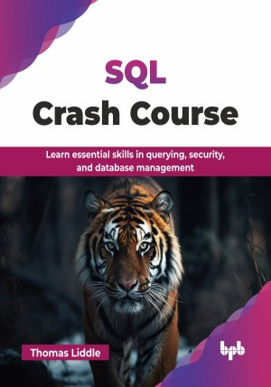

# SQL Crash Course

Learn essential skills in querying, security, and database management.

This is the repository for [SQL Crash Course
](https://bpbonline.com/products/sql-crash-course?_pos=1&_sid=2b3fccd76&_ss=r&variant=44749798211784?variant=44749798211784),published by BPB Publications.

## About the Book
SQL is the foundational language for interacting with relational databases and is the backbone of data management. Whether you are new to databases or looking to sharpen your data skills, this book provides the essential knowledge to retrieve, modify, and manage data effectively using SQL.

This book begins with database theory, explaining relational databases and core SQL syntax. It then progresses to data retrieval and manipulation operations, including advanced techniques, such as joins, subqueries, and set operators. You will learn to manage database objects with indexes, views, and triggers, explore advanced SQL techniques like window functions and common table expressions (CTEs), and learn how to optimize queries for peak performance. The book culminates in practical projects that apply everything you have learned to real-world scenarios, preparing you for immediate, hands-on application.

By the end of the book, you will not only understand SQL syntax and commands but also gain practical experience through guided projects that simulate real job scenarios. This book enables you to confidently work with relational databases and apply SQL in your day-to-day responsibilities across various tools and platforms. 

## What You Will Learn
• Learn SQL fundamentals, from syntax to database schema design.

• Write clean and efficient SQL queries using core commands.

• Retrieve, filter, sort, and aggregate data from relational databases.

• Insert, update, and delete records while maintaining data integrity.

• Join multiple tables to extract meaningful, connected data insights.

• Use functions, operators, and clauses to manipulate and analyze data.

• Handle data types, conversions, and string manipulation techniques.

• Apply SQL skills in real-world projects across various job roles.
